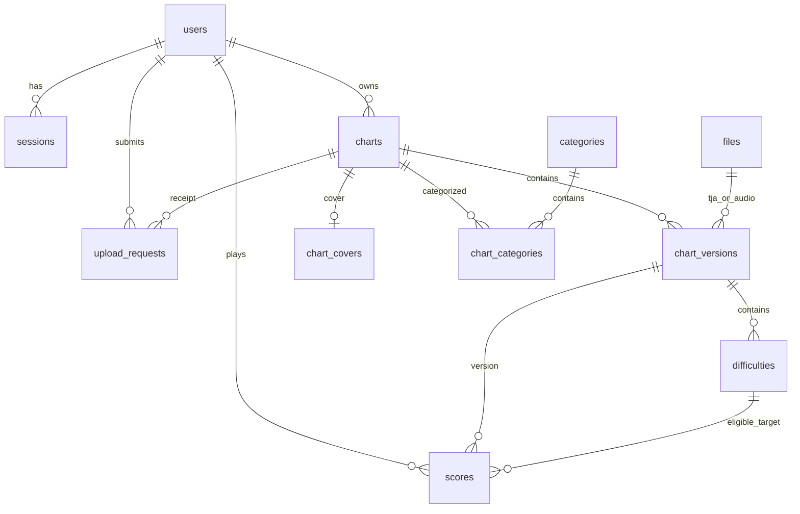

# Fanmade 后端数据库结构

本文按当前源码（基线提交 `4111bf6`）整理，描述完整执行迁移 001–020 后的 PostgreSQL 结构；不是生产数据库的实时巡检结果。结构依据为 [SQL 迁移](../internal/database/)、[迁移入口](../internal/database/database.go) 和 [SSO 迁移入口](../internal/database/sso.go)。

## 数据职责与总览

Fanmade 保存用户上传的谱面、音频索引、网站封面、分类、成绩和网站会话。账号资料、密码、语言偏好及应用管理员角色由 SSO 管理，本地 `users` 保存稳定 ID 与本站首次登录/最近活跃时间。昵称通过 SSO 查询，不复制进谱面或成绩。

| 数据库 | 保存内容 | 身份关联 |
| --- | --- | --- |
| OurTaikoSSO | 账号、应用、认证凭证与会话 | 账号 ID 的权威来源 |
| Fanmade | 上传作品、资源、成绩、网页会话 | `users.id` 对应 SSO 用户 ID |
| ESE | ESE 仓库曲库、历史版本、成绩 | 独立存储；不共享 Fanmade 表 |

跨库用户 ID 是应用级关联，没有指向 SSO 的 PostgreSQL 外键。Fanmade 的用户行不等于有效登录，每次受保护请求仍需 SSO 验证。

当前共 **14 张表**（含 schema_migrations）。下文未标注“可空”的字段均为 `NOT NULL`；`PK` 为主键，`UQ` 为唯一约束，时间均为 `timestamptz`。业务 ID 通常由应用生成 32 位小写十六进制字符串，但 Fanmade 多数 `text` ID 列没有对应正则 CHECK。

`charts.current_version_id` 另以复合外键指向本作品版本；`oidc_flows`、`retired_files`、`schema_migrations` 是独立辅助表。

## 账号与网站认证

### users

| 字段 | 类型 / 约束 | 用途 |
| --- | --- | --- |
| id | text PK | SSO 稳定用户 ID，旧账号迁移保持原值 |
| first_login_at | timestamptz，可空，无默认值 | 功能上线后首次成功登录本站的记录时间；不是 SSO 注册时间 |
| last_active_at | timestamptz，可空，无默认值 | 最近登录或成功认证请求的记录时间 |

018 已删除登录名、密码哈希、邮箱、昵称、管理员状态及注册时间。020 只增加本站活动时间，不重新保存账号资料。不要依据初始 `schema.sql` 把历史账号字段视作当前结构。

020 不回填未知历史日期：现有行两个时间保持 NULL。成功游戏登录或 OIDC 回调首次设置 first_login_at；持有旧会话访问只更新 last_active_at，不伪造首次登录。网页会话创建与首次登录写入同一事务。

鉴权成功后按用户原子 UPSERT，first_login_at 仅从 NULL 变成已记录时间；last_active_at 最多约每分钟更新一次并保持不倒退。SSO 拒绝或故障不更新时间。CHECK 要求 first_login_at 非空时，last_active_at 非空且不早于它。页面显示“暂无记录”代表尚无可用记录，不代表用户从未使用过服务。

### sessions

| 字段 | 类型 / 约束 | 用途 |
| --- | --- | --- |
| token_hash | text PK | 本站 Cookie 随机凭证的 SHA-256 |
| user_id | text FK → users.id，ON DELETE CASCADE | 会话所属用户 |
| csrf_token | text | 本站 CSRF 校验值 |
| expires_at | timestamptz | 到期时间 |
| upstream_token | bytea | AES-256-GCM 加密的 SSO OAuth access token，密文绑定 token_hash |

索引：`sessions_expiry(expires_at)`。网站会话最长一小时，且不超过上游令牌到期时间；没有自动 refresh。游戏 token 不写入此表。加密密钥在服务私有配置中，数据库备份不能替代密钥备份。

### oidc_flows

| 字段 | 类型 / 约束 | 用途 |
| --- | --- | --- |
| state_hash | text PK | OAuth state 的哈希 |
| binding_hash | text | 发起登录的浏览器绑定值哈希 |
| nonce | text | OIDC ID token nonce |
| verifier | text | PKCE verifier，敏感临时数据 |
| return_path | text | 校验后的本站返回路径 |
| expires_at | timestamptz | 创建后五分钟到期 |

索引：`oidc_flows_expiry(expires_at)`。回调通过 `DELETE … RETURNING` 原子消费，防止重复使用；发起新流程时清理过期行。本表没有用户外键。

## 作品、资源与展示

### files

| 字段 | 类型 / 约束 | 用途 |
| --- | --- | --- |
| id | text PK | 文件 ID |
| storage_key | text UQ | `STORAGE_DIR` 下的相对存储键 |
| original_filename | text | 文件名 |
| sha256 | text，CHECK 长度为 64 | 实际保存字节的 SHA-256；SQL 仅约束长度 |
| byte_size | bigint，CHECK > 0 | 保存字节数 |
| media_type | text | 媒体类型 |

TJA 和音频实际字节位于磁盘，本表只存索引与校验信息。`sha256` 没有唯一约束，不表示按内容全局去重。新 TJA 统一保存为无 BOM UTF-8，历史资源不因文档或编码策略调整而自动改写。

### charts

| 字段 | 类型 / 默认值 / 约束 | 用途 |
| --- | --- | --- |
| id | text PK | 稳定作品 ID |
| owner_id | text FK → users.id | 上传者 |
| description | text，默认空串 | 作品说明 |
| status | text，默认 published；published/deleted/hidden | 发布、软删除、隐藏 |
| current_version_id | text | 当前版本 |
| created_at | timestamptz，默认 now() | 创建时间 |
| title_override | text，可空 | 标题覆盖；非空时去首尾空格后非空，最多 500 字节 |
| subtitle_override | text，可空 | 副标题覆盖，最多 500 字节，可为空串 |
| title_translation_overrides | jsonb，默认 {}，CHECK 为 object | 各语言标题覆盖 |
| subtitle_translation_overrides | jsonb，默认 {}，CHECK 为 object | 各语言副标题覆盖 |
| metadata_updated_at | timestamptz，可空 | 展示元数据更新时间 |

复合 FK：`(id,current_version_id) → chart_versions(chart_id,id)`，`DEFERRABLE INITIALLY DEFERRED`，提交事务时检查。这样可在同一事务中创建作品和版本，或整体替换版本。

默认字段的 NULL、翻译对象中缺少对应语言键，表示继承版本元数据。JSONB CHECK 只保证是对象，语言键和内容规则由应用校验。

### chart_versions

| 字段 | 类型 / 默认值 / 约束 | 用途 |
| --- | --- | --- |
| id | text PK | 版本 ID |
| chart_id | text FK → charts.id | 所属作品 |
| version_number | integer，CHECK > 0 | 作品内版本号 |
| title | text | 文件解析的默认标题 |
| subtitle | text，默认空串 | 默认副标题 |
| title_translations / subtitle_translations | jsonb，各默认 {}，CHECK 为 object | 文件内 ja/zh/ko 翻译 |
| bpm | double precision，CHECK > 0 且 < Infinity | BPM |
| offset_seconds / demo_start | double precision，各默认 0 | 偏移与试听起点，秒 |
| duration | double precision，CHECK > 0 且 ≤ 1200 | 音频时长，秒 |
| encoding | text，utf-8 / shift-jis | 实际保存的 TJA 编码 |
| wave_filename | text | 音频文件名 |
| tja_file_id / audio_file_id | text，各 FK → files.id | 两个资源文件 |
| validation_version | text | 解析校验规则版本 |

UQ：`(chart_id,version_number)`、`(chart_id,id)`。014 已删除旧的 `maker` 列，署名存在难度块中。当前表没有 `created_at` 列。当前整体替换接口会删除历史版本，因此此表并非永久版本档案。

### difficulties

| 字段 | 类型 / 默认值 / 约束 | 用途 |
| --- | --- | --- |
| version_id | text FK → chart_versions.id，ON DELETE CASCADE | 所属版本 |
| block_index | integer | TJA 谱面块序号；与 version_id 组成 PK |
| course | text | 新写入只允许 Easy/Normal/Hard/Oni/Edit |
| level | integer，CHECK 1–10 | 星级 |
| player | text，默认空串；空串/P1/P2 | 玩家标记 |
| style | text；Single/Double，无默认值 | 后端逐块解析的模式 |
| cloud_score_eligible | boolean STORED 生成列 | `style = 'Single' AND player = ''` |
| maker | text，默认空串 | 本难度制作者 |

额外 CHECK：`player = '' OR style = 'Double'`。UQ `difficulties_score_target(version_id,block_index,course,cloud_score_eligible)` 供成绩复合外键引用。

012 的 course CHECK 使用 `NOT VALID`：不扫描否定历史归档数据，但仍约束后续插入/更新。历史 Tower/Dan 行可能存在。云成绩资格由数据库计算，不能直接写入；Double 可保留和游玩，不能接受云成绩。API 歌曲级 maker 由各块署名去重汇总，不另存一列。

### categories 与 chart_categories

| 表 | 字段 | 类型 / 约束 |
| --- | --- | --- |
| categories | id | text PK，匹配 `^[a-z][a-z0-9-]{0,63}$` |
| categories | title / genre | text，各非空 |
| categories | sort_order | integer UQ |
| chart_categories | category_id | text FK → categories.id |
| chart_categories | chart_id | text FK → charts.id，ON DELETE CASCADE |

关联表 PK 为 `(category_id,chart_id)`，作品可属于多个分类。额外索引 `chart_categories_chart(chart_id)`。013 将已有作品归入 Variety；017 新增 Anime，当前种子分类为 Game、Virtual Singer、Pop、Classic、Variety、Anime。数据库没有“作品至少一个分类”的 CHECK，此规则由业务流程保证。

### chart_covers

| 字段 | 类型 / 默认值 / 约束 | 用途 |
| --- | --- | --- |
| id | text PK | 封面 ID |
| chart_id | text UQ FK → charts.id，ON DELETE CASCADE | 每首作品最多一张 |
| webp | bytea，CHECK 12–8388608 字节 | 转换后的 WebP 内容 |
| sha256 | text，CHECK 64 位小写十六进制 | 内容哈希 |
| created_at | timestamptz，默认 now() | 创建时间 |

019 新增。封面直接保存在 PostgreSQL，不占用 `files` 行或持久磁盘副本。替换封面在事务内删除旧行并插入新行；只改封面不影响成绩。数据库只检查大小，完整图片解码和格式校验由应用完成。

## 成绩与幂等

### scores

| 字段 | 类型 / 默认值 / 约束 | 用途 |
| --- | --- | --- |
| id | text PK | 每局成绩 ID |
| user_id | text FK → users.id | 成绩所属账号 |
| song_id | text FK → charts.id | 作品 ID |
| version_id | text | 提交时版本 |
| block_index | integer | 对应难度块 |
| difficulty | text | Easy/Normal/Hard/Oni/Edit；CHECK 为 NOT VALID |
| cloud_score_eligible | boolean，默认 true，CHECK 为 true | 强制关联可计分难度 |
| good / ok / bad | integer，各 CHECK ≥ 0 | 良、可、不可 |
| score | bigint，CHECK 0–9007199254740991 | 总分，兼容 JavaScript 安全整数范围 |
| drumroll / max_combo | integer，各 CHECK ≥ 0 | 连打数、最大连击；max_combo 无默认值 |
| submitted_at | timestamptz，默认 now() | 服务端保存时间 |
| idempotency_key | text，可空 | 可选重试键 |
| payload_digest | text，CHECK 长度为 64 | 请求摘要 |

复合 FK：`(song_id,version_id) → chart_versions(chart_id,id)`；`(version_id,block_index,difficulty,cloud_score_eligible) → difficulties(version_id,block_index,course,cloud_score_eligible)`。

UQ `(user_id,idempotency_key)`；NULL 允许多局独立提交，同用户同键同载荷返回原结果，不同载荷返回 409。每局一行，不覆盖最高分。排行榜从 `scores` 查询每人最高分，没有排行榜表或持久名次字段。数值和关联约束不等于服务端重放验分。

### upload_requests

| 字段 | 类型 / 默认值 / 约束 | 用途 |
| --- | --- | --- |
| user_id | text FK → users.id | 请求用户 |
| idempotency_key | text | 与 user_id 组成 PK |
| payload_digest | text | 内容摘要；SQL 无长度 CHECK |
| chart_id | text FK → charts.id | 请求结果作品 |
| created_at | timestamptz，默认 now() | 收据创建时间 |
| version_id | text，默认空串 | 请求结果版本；刻意不设版本 FK |

015 增加 version_id，并为既有收据回填当时的当前版本。收据在旧版本被替换后保留，使旧请求重试不能再次执行破坏性替换；结果版本已变化时返回冲突。

## 维护表与索引

| 表 | 字段 | 用途 |
| --- | --- | --- |
| retired_files | storage_key text PK；created_at timestamptz 默认 now() | 已提交的磁盘文件删除队列；无 files 外键，因为 files 行已删除 |
| schema_migrations | version integer PK；applied_at timestamptz 默认 now() | 逐项记录已经执行的迁移 |

除 PK/UQ 自动创建的索引外，显式索引如下：

| 索引 | 列 / 条件 | 用途 |
| --- | --- | --- |
| users_recent_activity | last_active_at DESC NULLS LAST, id | 用户广场最近活跃排序 |
| users_first_login | first_login_at DESC NULLS LAST, id | 首次登录从新到旧排序 |
| sessions_expiry | expires_at | 有效期查询 |
| oidc_flows_expiry | expires_at | 临时流程清理 |
| charts_published_recent | created_at DESC, id DESC；WHERE status='published' | 公开作品列表 |
| charts_owner | owner_id, created_at DESC | 用户作品 |
| chart_categories_chart | chart_id | 反查分类 |
| scores_user_recent | user_id, submitted_at DESC, id DESC | 个人历史 |
| scores_chart_difficulty | song_id, difficulty, version_id, submitted_at DESC | 作品难度成绩 |
| scores_leaderboard_best | song_id, version_id, difficulty, block_index, user_id, score DESC, submitted_at, id | 每人最高分及并列排序 |

PostgreSQL 不会为每个外键自动创建索引，不能把关系图当作索引清单。当前搜索主要依赖 ILIKE，没有全文搜索索引。

## 生命周期与迁移

- 修改网站展示元数据：写 charts 覆盖列，保留原文件、版本和成绩。
- 整体替换歌曲/谱面：保留 charts.id、归属及封面；删除该作品全部旧成绩、历史版本及相应难度；清除标题覆盖；旧的无引用文件行删除并把存储键加入 retired_files。新数据在同一事务发布，失败回滚。
- 软删除作品：status 改为 deleted，同时删除封面；谱面版本、资源、分类关系和成绩保留，但不再公开访问。
- 文件清理：启动时和每 30 秒重试 retired_files，磁盘删除成功或文件已不存在后移除队列行。不是通用的孤儿文件扫描器。
- 删除本地用户：仅 sessions 外键声明级联；已有作品、成绩、上传收据的外键通常会阻止直接物理删除。SSO 删除用户不会跨库级联删除业务数据。

| 迁移 | 变化 |
| --- | --- |
| 001 | users、sessions、files、charts、chart_versions、difficulties、upload_requests |
| 002 | P1/P2 与历史 Tower/Dan 支持 |
| 003 / 004 | style、云成绩生成列；读取 TJA 回填并修正按 COURSE 重置规则；004 在 Go 中实现 |
| 005 | scores 与成绩复合外键 |
| 006 / 007 | 原始多语言元数据与作品展示覆盖 |
| 008 / 009 / 010 | 历史管理员列、排行榜索引、max_combo |
| 011 / 012 | 历史邮箱验证表；限制新难度写入并隐藏不支持作品 |
| 013 / 014 | 多选分类；maker 迁至难度块 |
| 015 / 016 / 017 | 替换收据与文件清理队列；历史昵称；Anime 分类 |
| 018 | SSO 用户瘦身、清空旧会话、移除 registration_codes/email_send_limits、建立 oidc_flows |
| 019 | chart_covers |
| 020 | users.first_login_at / last_active_at、时间顺序约束和两个排序索引 |

`Migrate` 在事务与 advisory lock 内执行 001–017、019 和 020；随后 `MigrateSSO` 另开受保护事务执行 018。因此不能只用 `MAX(version)=20` 判断 SSO 迁移成功，必须检查 018 行。003/004/006 的历史回填需要与数据库配套的 TJA 文件，缺失或解析不一致会回滚。

有旧账号时，018 要求先完成备份确认及全部用户 ID 的 SSO 存在性核对，再删除账号资料列。旧资料导入不是双向同步。操作见 [SSO 文档](SSO.md)；回退 018 必须恢复迁移前业务数据库及匹配程序，不能只换二进制。

备份需包含 PostgreSQL、`STORAGE_DIR`、受限环境配置及会话加密密钥；数据库备份已包含封面。恢复时保持数据库与文件版本一致。本文只核对源码，不连接或修改生产数据，也不验证现有备份的可恢复性。

## 用户广场与个人空间

`GET /api/v1/users` 提供昵称搜索、分页和最近活跃/首次登录排序；`GET /api/v1/users/{id}` 提供单个本地用户的公开资料与统计。昵称实时从 SSO 批量查询，不落本地表。广场包含本地 users 行（含迁移旧用户），不枚举仅在 SSO 注册的其他账号。

公开字段仅为 id、nickname、firstLoginAt、lastActiveAt、chartCount、scoreCount。chartCount 统计当前可公开访问的作品；scoreCount 统计当前可公开作品版本的已保存成绩行，排除隐藏/已删除作品和旧版本。统计在后端从 charts/scores 聚合，不新增可能漂移的计数列；整体替换会删除旧成绩，因此不是累计历史游玩次数。

用户广场的计数、分页和统计使用同一只读 repeatable-read 快照；个人空间在一个 SQL 语句中聚合。访问他人的公开空间不更新该用户活跃时间。昵称查询失败时返回 null 和 profilesAvailable=false，仍可查看业务统计；昵称搜索依赖 SSO，故障返回 503 而非假装没有匹配用户。

个人空间作品列表通过 `GET /api/v1/charts?owner=<用户ID>` 精确筛选，保留原公开状态与支持难度检查。登录名、邮箱、权限与 token 不在公开响应中。完整参数见 [API 文档](API.md)。
