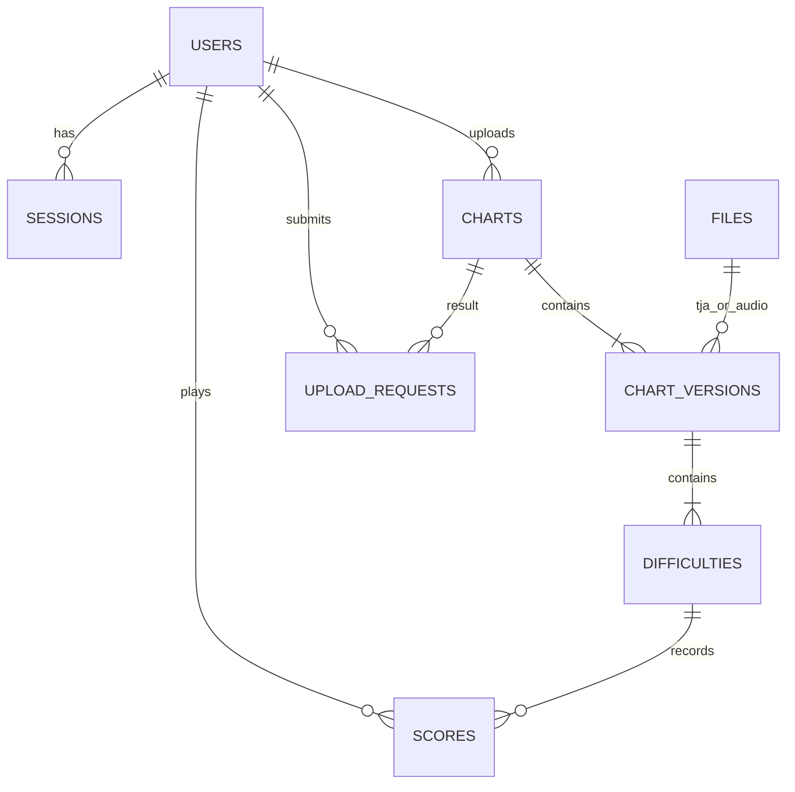

# PostgreSQL 数据结构（示范版实际实现）

数据库：`ourtaiko_fanmade`。迁移源文件为 `internal/database/schema.sql`、`002_ese.sql`、`003_cloud_score_policy.sql`、`005_scores.sql`；由 Go embed 编入程序并通过 `schema_migrations` 记录。迁移使用事务与 advisory lock，重复启动不会重建表。

| 表 | 关键字段 | 关系与约束 |
| --- | --- | --- |
| users | id(text)、username(text)、password_hash(text)、email(text nullable)、email_verified_at(timestamptz nullable)、created_at | 用户名唯一、3–24 位字母数字下划线；非空邮箱 lower(email) 唯一；验证时间非空要求邮箱非空 |
| sessions | token_hash(text PK)、user_id、csrf_token、expires_at | 外键关联用户；Cookie 令牌仅存 SHA-256；独立 CSRF 令牌；到期不可使用 |
| files | id、storage_key、original_filename、sha256、byte_size(bigint)、media_type | storage_key 唯一；正数大小；SHA-256 为 64 位十六进制字符串 |
| charts | id、owner_id、description、status、current_version_id、created_at | 状态 published/deleted/hidden；作品与当前版本复合外键，延迟到事务提交校验 |
| chart_versions | id、chart_id、version_number、title、subtitle、maker、bpm、offset_seconds、demo_start、duration、encoding、wave_filename、tja_file_id、audio_file_id、validation_version | 作品内版本号唯一；分别关联两份资源；时长 0–1200 秒，正数有限 BPM |
| difficulties | version_id、block_index(integer)、course、level(integer)、player、style、cloud_score_eligible | 版本+块序号复合主键；支持 Easy/Normal/Hard/Oni/Edit/Tower/Dan；level 1–10；player 空/P1/P2；style 为 Single/Double；资格为数据库生成列 |
| upload_requests | user_id、idempotency_key、payload_digest、chart_id、created_at | 用户+请求键复合主键；服务端计算载荷摘要，幂等冲突返回 409 |
| scores | id、user_id、song_id、version_id、block_index、difficulty、cloud_score_eligible、good、ok、bad、score、drumroll、submitted_at、idempotency_key、payload_digest | 关联用户、作品版本及有资格的难度块；计数非负；同用户请求键唯一 |
| schema_migrations | version(integer PK)、applied_at | 已应用版本为 1、2、3、4、5、6、7 |

业务 ID 由服务端密码学随机数生成，为 32 位十六进制文本。时间戳使用 timestamptz。文本编码、BPM 和难度均从服务端实际读取的 TJA 中提取，不信任客户端元数据。

`cloud_score_eligible` 为 STORED 生成列，表达式为 `style = 'Single' AND player = ''`，不能直接赋值。约束禁止带 P1/P2 的记录标为 Single。Double 谱面保留资源与难度记录，排除云端成绩和未来排行榜；混合文件中的 Single 块不受影响。

迁移 003 从 `STORAGE_DIR` 中的原始 TJA 重新解析所有历史版本（包括已隐藏／删除作品），逐块回填 style，覆盖没有 P1/P2 标记的 `STYLE:Double`。缺少文件、解析失败或块不一致时整笔迁移回滚，不猜测资格；恢复配套资源后重试。迁移 004（`database.go` 中的数据迁移）使用按 COURSE 重置 STYLE 的规则再次回填，纠正已执行 003 时可能产生的跨难度误判。原始文件、版本 ID、文件哈希和原 `validation_version` 不改写。新上传使用 `tja-upload-v3`，新增记录必须显式提供后端解析的 style。

迁移 005 新增 scores 表。成绩接口读取资格后写入，数据库通过复合外键约束 scores 的版本、难度、块序号及资格一致：cloud_score_eligible 在 scores 中恒为 true，因此不能指向 Double。该资格不代表游戏兼容性、成绩重算或防作弊已实现。

每局保留一行，不覆盖历史最高分。用户关联 Session 所属账号；song_id + version_id 关联同一作品的版本；成绩保留具体版本和块的外键，物理删除被引用资源会受约束，作品软删除不删除成绩。分数为 bigint（0–9007199254740991），良／可／不可及连打为非负 integer。submitted_at 由数据库生成。可空 idempotency_key 与 user_id 联合唯一，NULL 允许多次独立游玩；payload_digest 用于判定相同键的重试载荷是否一致。

查询索引覆盖发布作品时间顺序、用户作品列表、Session 过期时间和唯一邮箱。示范版搜索使用 ILIKE，分页使用 page/pageSize（每页 12）；全文索引与游标分页留到规模增长后。

邮箱验证码／验证链接令牌表尚未创建。后续需要新增只存 token_hash 的单次限时验证表，并为未验证账号限制投稿；不把示范版用户自动视为邮箱已验证。

## 多语言解析与展示修改

新增迁移文件 `006_localized_titles.sql`、`007_metadata_overrides.sql`。迁移 006 为 chart_versions 增加 title_translations、subtitle_translations（JSONB，默认空对象），保存 ja/zh/ko 原始解析值；默认英文继续使用 title/subtitle。迁移从配套原始 TJA 回填所有版本，新上传直接写入，目前后端校验版本为 tja-upload-v4。

迁移 007 为 charts 增加 title_override、subtitle_override（nullable text）、title_translation_overrides、subtitle_translation_overrides（JSONB）及 metadata_updated_at。NULL 默认字段／无覆盖语言键意味着继承文件版本的值。查询使用 COALESCE 与 JSONB 合并得到实际展示数据，成绩表与文件版本不改动。覆盖信息是作品级设置，未来替换版本功能需要明确继承／清除策略。详情见 [多语言与管理说明](LOCALIZATION.md)。
